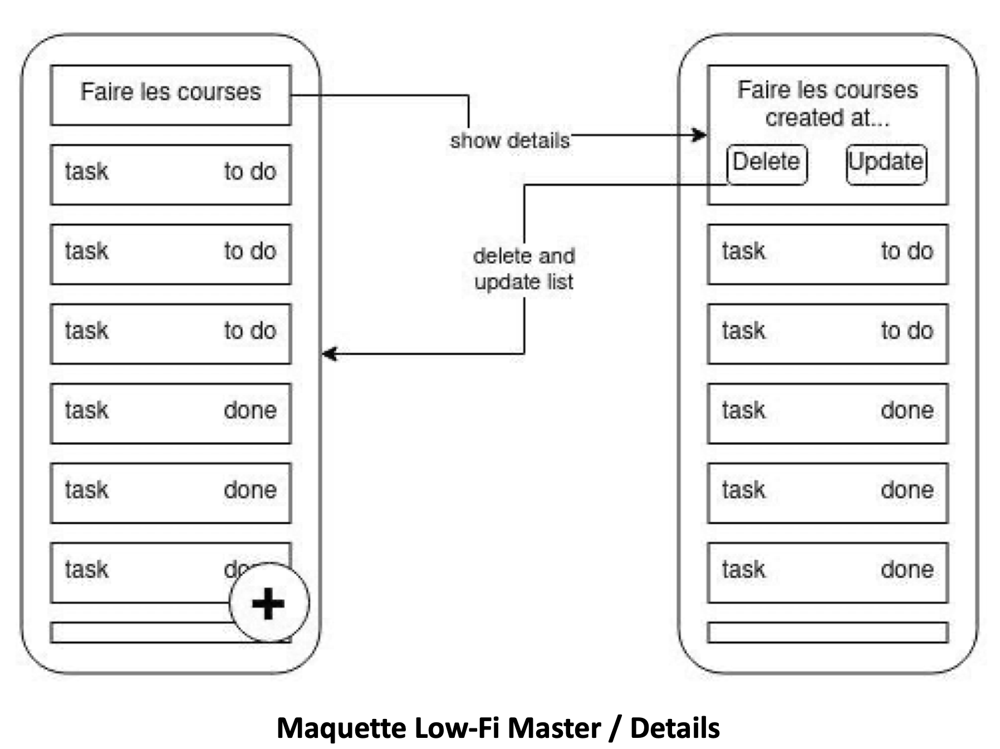

# Flutter_todolist_Ziyi_WANG

# Introduction des fonctionnalités réalisées
<ol>
    <li>
        Une fois inscription effectuée, vous vous connectez avec vos identifiants. Une fois connection effectuée, vous pouvez consulter AllTask.
    </li>
    <li>
        Lorsqu'un composant TaskPreview est cliqué, il doit afficher les détails d‘une tâche.
    </li>
    <li>
        Si l'utilisateur clique sur le bouton de suppression, la Task concernée doit-être supprimée et les données du composant TaskMaster mises à jour.
        
    </li>
    <li>Le partage et la synchronisation de données. In widget <code>Consumer <'TasksCollection'> </code> avec communication via ChangeNotifier permettant d'interragir avec la source de données partagée,</li>
    <li>
    Cliquez sur le bouton d'ajouter permet de créer un task et ajouter à la fin d'une liste.
    </li>
    <li>Cliquez sur le bouton d'update permet de mise à jour un task avec une confirmation de mise à jour </li>
</ol>

# Lien utiles
<a href="https://github.com/ziyi-hub/todolist_WANG">Lien du github</a>

